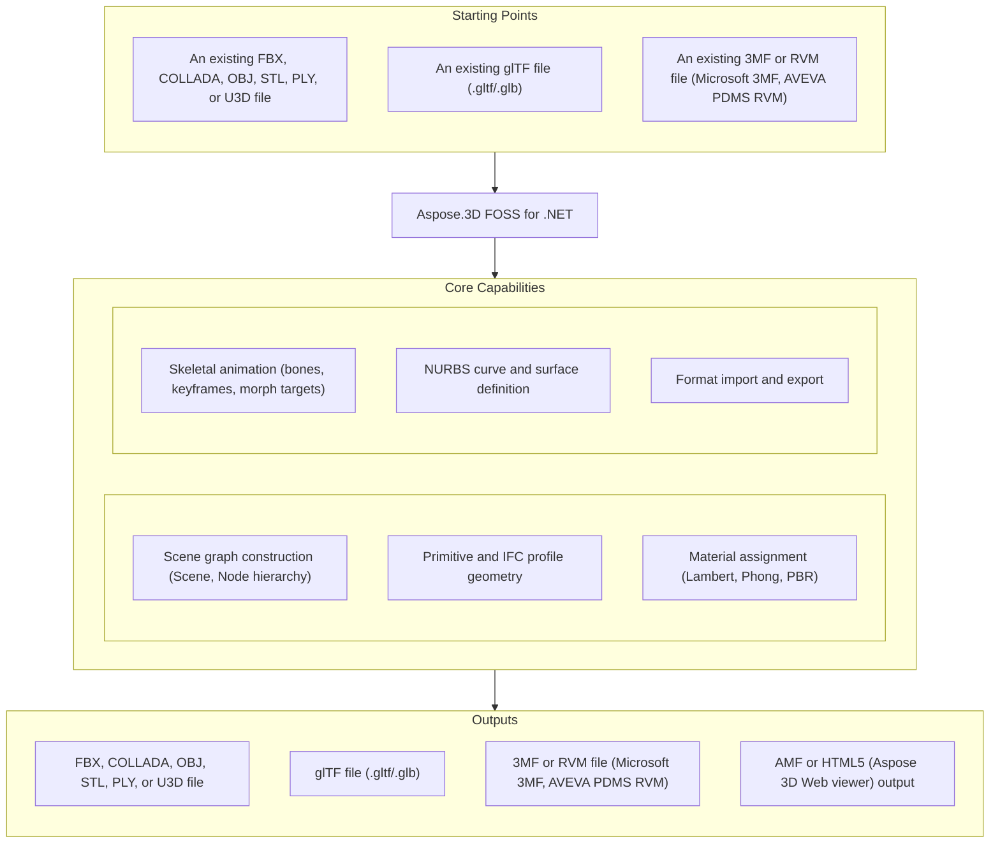

# Aspose.3D FOSS for .NET

[](https://www.nuget.org/packages/Aspose.3D.FOSS/) [](LICENSE) [](https://github.com/aspose-3d-foss/Aspose.3D-FOSS-for-.NET/graphs/contributors)

[](https://products.aspose.org/3d/net/)

Aspose.3D FOSS for .NET is a free, open-source, MIT-licensed .NET library for building and
converting 3D scenes without any external 3D engine. It exposes an Aspose.3D-compatible API
surface — `Scene`, `Node`, `Mesh`, `Material` — for constructing scene graphs from primitive and
IFC-style profile geometry, assigning shading materials, animating hierarchies, and reading and
writing widely used interchange formats such as FBX, glTF, Wavefront OBJ, STL, COLLADA, and
Universal 3D, as pure managed code with no native dependencies.

## Navigation

- [At a Glance](#at-a-glance)
- [Key Capabilities](#key-capabilities)
- [Installation](#installation)
- [Quick Start](#quick-start)
- [Additional Examples](#additional-examples)
- [API Reference](#api-reference)
- [Documentation & Resources](#documentation--resources)
- [Scope and Limitations](#scope-and-limitations)
- [Development and Testing](#development-and-testing)
- [License](#license)

## At a Glance



## Key Capabilities

- Build, traverse, and manage a 3D scene graph with `Scene` and `Node` — every `Scene` starts
  with a `RootNode`, and `Node.CreateChildNode()` / `AddChildNode()` attach child nodes carrying
  entities, transforms, and materials.
- Construct primitive and CAD-style profile geometry directly — `Box`, `Cylinder`, `Sphere`,
  `Dish`, `Torus`, `Pyramid`, `Plane`, and a set of IFC-compatible 2D profiles (`LShape`,
  `TShape`, `UShape`, `ZShape`, `CShape`, `HShape`, `CircleShape`, `RectangleShape`, and more)
  that can be extruded or revolved into solids via `LinearExtrusion`, `RevolvedAreaSolid`, and
  `SweptAreaSolid`.
- Assign shading materials through `Material` subclasses — `LambertMaterial`, `PhongMaterial`,
  `PbrMaterial`, `PbrSpecularMaterial`, and `ShaderMaterial` — each attaches to a `Node`
  independently of the entity it carries.
- Animate scenes with `AnimationClip` and `AnimationChannel`, keyed by `KeyFrame`/
  `KeyframeSequence`, and skin meshes with `Bone`, `Skeleton`, and `SkinDeformer`; morph-target
  animation is available through `MorphTargetDeformer` and `MorphTargetChannel`.
- Define NURBS curves and surfaces with `NurbsCurve` and `NurbsSurface`, specifying control
  points, weights, and knot vectors directly.
- Convert 3D scenes by reading and writing FBX, glTF, Wavefront OBJ, STL, COLLADA, and Universal
  3D (U3D) — including FBX-to-OBJ and glTF-to-OBJ conversions — with full round-trip fidelity,
  plus Microsoft 3MF and AVEVA PDMS RVM models, AMF, and an HTML5/Aspose 3D Web viewer export,
  through `Scene.FromFile()`/`Scene.Save()` and the matching `FileFormat` constants.
- Configure per-format load/save behavior through dedicated options types (`FbxLoadOptions`/
  `FbxSaveOptions`, `GltfLoadOptions`/`GltfSaveOptions`, `ObjLoadOptions`/`ObjSaveOptions`,
  `StlLoadOptions`/`StlSaveOptions`, and their COLLADA/3MF/RVM/U3D counterparts).
- Read and write per-vertex mesh data through a custom `VertexDeclaration` and `VertexElement`
  subclasses — normals, UVs, vertex color, tangent/binormal, smoothing groups, and user data.

## Installation

Install the library from NuGet:

```bash
dotnet add package Aspose.3D.FOSS --version 26.1.0
```

The library (`src/main/Aspose.ThreeD/Aspose.ThreeD.csproj`) targets `net6.0`, `net8.0`,
`net10.0`, and `netcoreapp3.1` in Release builds, so it can be consumed by any compatible modern
.NET runtime. The repository also contains a separate console conversion tool
(`src/converter/Converter.csproj`, package id `Aspose.3D.Converter`) that references the library
as a project; it is not published to NuGet.

## Dependencies

### Required Package Dependencies

No required third-party package dependencies. The published `Aspose.3D.FOSS` package builds from
`src/main/Aspose.ThreeD/Aspose.ThreeD.csproj`, which declares zero `<PackageReference>` entries.

### Native and System Requirements

- Targets `netcoreapp3.1`, `net6.0`, `net8.0`, and `net10.0` in Release builds — runs on any
  compatible .NET Core 3.1 or later .NET/.NET Core runtime.

### Development Dependencies

- `Microsoft.NET.Test.Sdk` (17.12.0), `xunit` (2.9.2), and `xunit.runner.visualstudio` (2.8.2) —
  the test framework and runner used by the test suite (see
  [Development and Testing](#development-and-testing)).
- `coverlet.collector` (6.0.2) — code-coverage collection for the test suite.

## Quick Start

Build a scene from a primitive, assign a material, and save it to FBX:

```csharp
using Aspose.ThreeD;
using Aspose.ThreeD.Entities;
using Aspose.ThreeD.Shading;

// Create a new scene and add a box primitive to the root node
var scene = new Scene();
var material = new LambertMaterial("Body")
{
    DiffuseColor = new Vector3(0.6, 0.6, 0.6),
};
scene.RootNode.CreateChildNode("Box", new Box(2, 2, 2), material);

// Save to FBX
scene.Save("output.fbx", FileFormat.FBX7400Binary);
```

## Additional Examples

Additional worked examples cover loading an existing scene and converting between formats.

Load an existing glTF scene and re-save it as an OBJ:

```csharp
using Aspose.ThreeD;

var scene = Scene.FromFile("input.gltf");
scene.Save("output.obj", FileFormat.WavefrontOBJ);
```

<details><summary>View Additional Examples</summary>

### Enumerate a Scene's Node Hierarchy

Enumerate a loaded scene's node hierarchy:

```csharp
using Aspose.ThreeD;

var scene = Scene.FromFile("input.fbx", FileFormat.FBX7400Binary);
foreach (var node in scene.RootNode.ChildNodes)
{
    System.Console.WriteLine(node.Name);
}
```

### Convert a Lambert Material to PBR

Assign a PBR material converted from an existing Lambert material:

```csharp
using Aspose.ThreeD.Shading;

var lambert = new LambertMaterial("Body");
var pbr = PbrMaterial.FromMaterial(lambert);
```

### Load OBJ With Custom Options and Export to STL

Load OBJ with options and export as STL:

```csharp
using Aspose.ThreeD;
using Aspose.ThreeD.Formats;

var scene = new Scene();
var opts = new ObjLoadOptions();
opts.FlipCoordinateSystem = true;
opts.NormalizeNormal = true;
scene.Open("mesh.obj", opts);

scene.Save("mesh.stl");
```

### Save a Scene to COLLADA Through a Stream

Save a scene to COLLADA through a stream:

```csharp
using Aspose.ThreeD;
using Aspose.ThreeD.Entities;
using Aspose.ThreeD.Formats;

var scene = new Scene();
var box = new Box(2, 2, 2);
scene.RootNode.CreateChildNode("BoxNode", box);

using var stream = new MemoryStream();
var options = new ColladaSaveOptions();
scene.Save(stream, options);
```

### Handle an Unrecognized 3D File Format

Handle an unrecognized file format:

```csharp
using Aspose.ThreeD;

var scene = new Scene();
try
{
    scene.Open("unknown.xyz");
}
catch (ArgumentException)
{
    // No matching FileFormat could be resolved for the extension.
}
```

</details>

## API Reference

`Scene` is the primary entry point: it owns a `RootNode` (`Node`) hierarchy, and its static
`FromFile()`/`FromStream()` and instance `Save()` methods perform format-aware loading and
saving via the `FileFormat` registry.

<details>
<summary>View Selected API Surface</summary>

### Main

| Class | Description |
|---|---|
| `A3DObject` | The base class of all Aspose.ThreeD objects; all subclasses support dynamic properties. |
| `A3dwSaveOptions` | Save options for the A3DW format (registered, not implemented in this FOSS build). |
| `AmfSaveOptions` | Save options for AMF. |
| `AnimationChannel` | Stores a sequence of keyframes and provides `Add(time, value)` to insert new keyframe data. |
| `AnimationClip` | A collection of animations. |
| `AnimationNode` | Aspose.3D's animation hierarchy — each animation can be composed of several animations and their key-frame definitions. |
| `ArbitraryProfile` | Constructs a 2D profile directly from an arbitrary curve. |
| `AssetInfo` | Information about an asset. |
| `AxisSystem` | A combination of coordinate system, up vector, and front vector. |
| `BindPoint` | Created on an object's property; multi-component fields (like `Vector3`) generate a channel per component, connected to one or more keyframe sequences. |
| `Bone` | Defines the subset of the geometry's control points and the blend weight for each control point. |
| `BonePose` | Contains the transformation matrix for a bone node. |
| `BooleanOperand` | Encapsulates the transformed mesh as a Boolean operation's operand (the operation itself is not executed in this FOSS build — see Scope and Limitations). |
| `BooleanOperator` | Combines two `BooleanOperand`s with a `BooleanOperation` (union, intersection, subtraction). |
| `Box` | Parameterized box primitive. |
| `CShape` | IFC-compatible C-shape profile defined by parameters. |
| `Camera` | Describes the eye point of the viewer looking at the scene. |
| `CenterLineProfile` | IFC-compatible center line profile. |
| `Circle` | A curve consisting of a set of points on the edge of a circle shape. |
| `CircleShape` | IFC-compatible circle profile that can be extruded into a mesh. |
| `ClassType` | Class definition metadata. |
| `ColladaSaveOptions` | Save options for COLLADA. |
| `CompositeCurve` | A curve consisting of several curve segments. |
| `Curve` | The base class of all curve implementations. |
| `CustomObject` | Represents custom object data. |
| `Cylinder` | Parameterized cylinder primitive. |
| `Deformer` | Base class for `SkinDeformer` and `MorphTargetDeformer`. |
| `DescriptorSetUpdater` | Updates a descriptor set in a chain operation. |
| `Discreet3dsLoadOptions` | Load options for 3DS files. |
| `Discreet3dsSaveOptions` | Save options for 3DS files. |
| `Dish` | Parameterized dish primitive. |
| `DracoFormat` | Google Draco format registration — encode and decode both throw in this FOSS build (see Scope and Limitations). |
| `DracoSaveOptions` | Save options for Draco files. |
| `DriverException` | Exception raised by internal rendering drivers. |
| `Ellipse` | A curve defining the shape of an ellipse. |
| `EllipseShape` | IFC-compatible ellipse profile. |
| `Entity` | The base class of all entities (geometry, cameras, lights). |
| `EntityRenderer` | Base class to implement rendering for different kinds of entities. |
| `EntityRendererKey` | The key of a registered entity renderer. |
| `EnumType` | Reflection metadata describing an enum type. |
| `EnumValue` | A single named value of an `EnumType`. |
| `ExportException` | Exception raised on export failure. |
| `Extrapolation` | Controls the extrapolation mode (via `ExtrapolationType`) applied outside a keyframe sequence's range. |
| `FbxLoadOptions` | Load options for FBX format. |
| `FbxSaveOptions` | Save options for FBX format. |
| `FileFormat` | File format registry and definition — exposes the static format constants used with `Scene.Save()`/`FromFile()`. |
| `FileFormatType` | File format family type. |
| `FileSystem` | File system encapsulation used during load/save. |
| `FontFile` | Font glyph definitions, used to create a `Text` profile. |
| `Frustum` | Base class of `Camera` and `Light`. |
| `GLSLSource` | Shader source code in GLSL. |
| `Geometry` | The base class of all renderable geometric objects (`Mesh`, `Box`, `Cylinder`, and similar). |
| `GlobalTransform` | The immutable final evaluated transformation, similar to `Transform` but read-only. |
| `GltfLoadOptions` | Load options for glTF format. |
| `GltfSaveOptions` | Save options for glTF format. |
| `Group` | Represents the logical relationships between entities. |
| `HShape` | IFC-compatible H/I-shape profile defined by parameters. |
| `HalfSpace` | An infinite space split by a plane. |
| `HollowCircleShape` | IFC-compatible hollow circle profile. |
| `HollowRectangleShape` | IFC-compatible hollow rectangular profile with inner/outer rounding. |
| `Html5SaveOptions` | Save options for HTML5 (Aspose 3D Web viewer) export. |
| `IOConfig` | IO configuration for serialization/deserialization. |
| `IOExtension` | Writes a `Matrix4` value to a `BinaryWriter`. |
| `ImageRenderOptions` | Options for image rendering (rendering itself is out of scope in this FOSS build). |
| `ImportException` | Exception raised on import failure. |
| `InitializationException` | Exception raised on initialization failure. |
| `JtLoadOptions` | Load options for Siemens JT (registered, not functional — see Scope and Limitations). |
| `KeyFrame` | A single keyframe in an animation sequence. |
| `KeyframeSequence` | An ordered sequence of `KeyFrame`s for a single property. |
| `LShape` | IFC-compatible L-shape profile defined by parameters. |
| `LambertMaterial` | Material for the Lambert shading model. |
| `License` | License management class (not applicable to this open-source edition). |
| `Light` | Illuminates the scene. |
| `Line` | A polyline defined by a set of points connected by segments. |
| `LinearExtrusion` | Extrudes a 2D profile shape along the third dimension. |
| `LoadOptions` | Base class for per-format load options. |
| `Material` | Base class defining the parameters for a geometry's visual appearance. |
| `MathUtils` | Vector/normal math helpers, e.g. `CalcNormal` for a polygon defined by `Vector3` points. |
| `Mesh` | A mesh made of many n-sided polygons. |
| `Metered` | Metered license management class (not applicable to this open-source edition). |
| `Microsoft3MFFormat` | Microsoft 3MF format registration and utilities — core geometry import/export works; build-instruction metadata is not implemented (see Scope and Limitations). |
| `Microsoft3MFSaveOptions` | Save options for Microsoft 3MF. |
| `MirroredProfile` | IFC-compatible mirrored profile. |
| `MorphTargetChannel` | Used by `MorphTargetDeformer` to organize target geometries. |
| `MorphTargetDeformer` | Provides per-vertex morph-target animation. |
| `Node` | An element in the scene graph — carries a transform, an optional entity, and child nodes; `CreateChildNode`/`AddChildNode`/`Merge`/`EvaluateGlobalTransform` attach and manage them. |
| `NurbsCurve` | A curve represented by NURBS (Non-Uniform Rational B-Spline) control points and a knot vector. |
| `NurbsDirection` | Per-direction data for a `NurbsSurface`'s U or V direction. |
| `NurbsSurface` | A surface represented by NURBS, defined by its U and V `NurbsDirection`s. |
| `ObjLoadOptions` | Load options for Wavefront OBJ format. |
| `ObjSaveOptions` | Save options for Wavefront OBJ format. |
| `ParameterizedProfile` | Base class of all parameterized 2D profiles. |
| `ParseException` | Exception raised on a parse failure. |
| `Patch` | A parametric modeling surface defined by two `NurbsDirection`s, similar to `NurbsSurface`. |
| `PatchDirection` | A `Patch`'s U or V direction. |
| `PbrMaterial` | Material for physically based rendering using albedo/metallic/roughness. |
| `PbrSpecularMaterial` | Material for physically based rendering using diffuse/specular/glossiness. |
| `PdfFormat` | Adobe PDF format registration — extraction/import throws in this FOSS build; export is not registered (see Scope and Limitations). |
| `PdfLoadOptions` | Options for PDF loading. |
| `PdfSaveOptions` | Options for PDF exporting. |
| `PhongMaterial` | Material for the Blinn-Phong shading model. |
| `PixelMapping` | Maps pixel coordinates for a texture unit. |
| `Plane` | Parameterized plane primitive. |
| `PlyFormat` | PLY format registration; its own direct `Encode`/`Decode` methods throw, but this is not the path `Scene.Save()`/`Scene.Open()` use — see PLY note in Scope and Limitations. |
| `PlyLoadOptions` | Load options for PLY files. |
| `PlySaveOptions` | Save options for PLY files. |
| `PointCloud` | Contains control points and vertex elements with no topology information. |
| `PolygonBuilder` | Helper to build a polygon for `Mesh`. |
| `PolygonModifier` | Mesh utility surface (triangulation, normal/UV generation, merge) — every operation throws in this FOSS build (see Scope and Limitations). |
| `Pose` | Stores the transformation matrix used when geometry is skinned. |
| `PostProcessing` | Post-processing effect settings (rendering is out of scope in this FOSS build). |
| `Primitive` | Base class for all parameterized primitives (`Box`, `Cylinder`, `Sphere`, and similar). |
| `Profile` | A 2D profile in the XY plane. |
| `Property-GLTF` | Exposes `GetExtra`/`SetExtra` for arbitrary user data and `GetBindPoint` for animation bind points. |
| `Property-ThreeD` | Holds user-defined properties. |
| `PropertyCollection` | A collection of `Property` instances. |
| `PropertyTable` | A table of `PropertyCollection` entries indexed by name. |
| `PushConstant` | Provides data to a shader through a push constant. |
| `Pyramid` | Parameterized pyramid primitive. |
| `RectangleShape` | IFC-compatible rectangular profile with rounded corners. |
| `RectangularTorus` | Parameterized rectangular torus primitive. |
| `RenderFactory` | Creates resources used in the rendering pipeline (rendering is out of scope in this FOSS build). |
| `RenderParameters` | Describes the parameters of a render target. |
| `RenderResource` | Base class for render resources. |
| `RenderState` | Pipeline render state. |
| `Renderer` | Rendering context. |
| `RendererVariableManager` | Manages variables used during rendering. |
| `RevolvedAreaSolid` | A solid built by revolving a profile's cross-section around an axis. |
| `RvmFormat` | AVEVA PDMS RVM format registration — core geometry import/export works; attribute loading is not implemented (see Scope and Limitations). |
| `RvmLoadOptions` | Load options for AVEVA PDMS RVM files. |
| `RvmSaveOptions` | Save options for AVEVA PDMS RVM files. |
| `SPIRVSource` | A shader compiled to SPIR-V. |
| `SaveOptions` | Base class for per-format save options. |
| `Scene` | The top-level container for nodes, geometries, materials, textures, animation, and poses. |
| `SceneObject` | The root class of objects stored inside a `Scene`. |
| `Segment` | A segment within a `CompositeCurve`. |
| `SemanticAttribute` | Declares the vertex field semantic for a custom vertex element. |
| `ShaderException` | Shader-related exceptions. |
| `ShaderMaterial` | A material described by an external rendering engine or shader language. |
| `ShaderProgram` | A compiled shader program. |
| `ShaderSet` | The set of shader programs for each material kind. |
| `ShaderSource` | Shader source code. |
| `ShaderTechnique` | A concrete rendering implementation for a technique. |
| `ShaderVariable` | A shader variable. |
| `Shape` | Describes deformation on a set of control points, similar to a Maya cluster deformer. |
| `Skeleton` | Manipulates the transformation of a skeletal structure. |
| `SkinDeformer` | Blends geometry across multiple bones using per-control-point weights. |
| `Sphere` | Parameterized sphere primitive. |
| `StencilState` | Per-face stencil states. |
| `StlLoadOptions` | Load options for STL format. |
| `StlSaveOptions` | Save options for STL format. |
| `StructuralMetadata` | glTF `EXT_structural_metadata` support — not implemented in this FOSS build. |
| `SweptAreaSolid` | A solid built by sweeping a profile along a directrix. |
| `TShape` | IFC-compatible T-shape profile defined by parameters. |
| `Text` | A profile describing contours from a font and text. |
| `Texture` | A texture sourced from an external file. |
| `TextureBase` | Base class for all concrete textures. |
| `TextureCodec` | Manages texture encoders and decoders. |
| `TextureData` | Raw pixel data and format definition of a texture. |
| `TextureSlot` | A texture slot on a `Material`. |
| `Torus` | Parameterized torus primitive. |
| `Transform` | Access to an object's local translate/scale/rotation or transform matrix. |
| `TransformBuilder` | Composes multiple transform matrices via `Append`/`Prepend`/`Scale`/`RotateDegree`, exposing the composed `Matrix`. |
| `TransformedCurve` | Gives a curve a placement via a transformation matrix. |
| `TrapeziumShape` | IFC-compatible trapezium profile defined by parameters. |
| `TriMesh` | Raw GPU-ready mesh buffer representation — most conversion/read helpers throw in this FOSS build (see Scope and Limitations). |
| `TrialException` | Trial-related exception (not applicable to this open-source edition). |
| `TrimmedCurve` | A bounded curve trimmed from a basis curve at both ends. |
| `U3dLoadOptions` | Load options for Universal 3D (U3D). |
| `U3dSaveOptions` | Save options for Universal 3D (U3D). |
| `UShape` | IFC-compatible U-shape profile defined by parameters. |
| `UsdSaveOptions` | Save options for USD/USDZ (registered, not implemented in this FOSS build). |
| `Vertex` | Reads component vectors (e.g. `ReadVector3`) from a vertex field. |
| `VertexDeclaration` | Defines a custom vertex layout via `AddField`; sealed once built. |
| `VertexElement` | Base class of vertex elements. |
| `VertexElementBinormal` | Per-vertex binormal data. |
| `VertexElementDoublesTemplate` | Helper base for `double`-typed vertex elements. |
| `VertexElementEdgeCrease` | Edge crease values for specified components. |
| `VertexElementFVector` | Helper base for `FVector`-typed vertex elements. |
| `VertexElementHole` | Marks whether a polygon is a hole. |
| `VertexElementIntsTemplate` | Helper base for `int`-typed vertex elements. |
| `VertexElementMaterial` | Material index for specified components. |
| `VertexElementNormal` | Per-vertex normal data. |
| `VertexElementPolygonGroup` | Groups related polygons together. |
| `VertexElementSmoothingGroup` | Groups polygons that should appear to form a smooth surface. |
| `VertexElementSpecular` | Per-vertex specular color. |
| `VertexElementTangent` | Per-vertex tangent data, exposed via `Tangents`. |
| `VertexElementTemplate` | Generic helper base for typed vertex elements. |
| `VertexElementUV` | Per-vertex UV coordinates. |
| `VertexElementUserData` | Custom user data for specified components. |
| `VertexElementVector4` | Helper base for `Vector4`-typed vertex elements. |
| `VertexElementVertexColor` | Per-vertex color. |
| `VertexElementVertexCrease` | Vertex crease values. |
| `VertexElementVisibility` | Marks whether specified components are visible. |
| `VertexElementWeight` | Per-vertex blend weight. |
| `VertexField` | Describes a custom vertex attribute's data type, semantic, alias, index, offset, and size. |
| `Viewport` | One or more render viewports for a scene (rendering is out of scope in this FOSS build). |
| `Watermark` | Embeds and extracts text watermarks in 3D files, with optional password protection. |
| `WindowHandle` | Encapsulated window handle for different platforms. |
| `XLoadOptions` | Load options for DirectX `.x` files. |
| `ZShape` | IFC-compatible Z-shape profile defined by parameters. |

#### Interfaces

| Interface | Description |
|---|---|
| `IArrayList` | Aspose.3D's own optimized `List<T>`-compatible collection for faster loading/saving. |
| `IBuffer` | Base interface of all managed rendering buffers. |
| `ICommandList` | Encodes a sequence of GPU rendering commands. |
| `IDescriptorSet` | Describes resources (buffers, textures) bound to the render pipeline. |
| `IIndexBuffer` | Describes the index geometry used by the rendering pipeline. |
| `IIndexedVertexElement` | A `VertexElement` that also carries index data. |
| `IMeshConvertible` | Implemented by entities that can be converted to a `Mesh`. |
| `INamedObject` | An object that has a name. |
| `IOrientable` | Implemented by entities that support orientation. |
| `IPipeline` | Pipeline interface (rendering is out of scope in this FOSS build). |
| `IRenderQueue` | Manages render tasks for an entity renderer. |
| `IRenderTarget` | Base interface of a render target. |
| `IRenderTexture` | Interface of a render texture. |
| `IRenderWindow` | Render window interface. |
| `ITexture1D` | A 1D texture. |
| `ITexture2D` | A 2D texture. |
| `ITextureCodec` | Codec interface for textures. |
| `ITextureCubemap` | A cube map texture. |
| `ITextureDecoder` | Implemented by external texture decoders. |
| `ITextureEncoder` | Implemented by external texture encoders. |
| `ITextureUnit` | A texture in memory shared between GPU and CPU. |
| `IVertexBuffer` | Holds polygon vertex data sent to the rendering pipeline. |

#### Structs

| Struct | Description |
|---|---|
| `BoundingBox` | An axis-aligned bounding box. |
| `BoundingBox2D` | A 2D bounding box initialized from minimum and maximum vectors. |
| `CubeFaceData` | Data for each face of a cube map texture. |
| `EndPoint` | A curve trim endpoint, given as a parameter value or a Cartesian point. |
| `FMatrix4` | A single-precision 4x4 matrix with `Concatenate`, `Transpose`, and `Inverse`. |
| `FVector2` | A single-precision 2D vector. |
| `FVector3` | A single-precision 3D vector. |
| `FVector4` | A single-precision 4D vector. |
| `Matrix4` | A double-precision 4x4 matrix with `Inverse()` and `Decompose()`. |
| `Quaternion` | A rotation, expressed as a quaternion. |
| `Rect` | A rectangle with a `Contains` point test. |
| `RelativeRectangle` | A rectangle given as left/top/width/height offsets. |
| `Vector2` | A double-precision 2D vector. |
| `Vector3` | A double-precision 3D vector, with scalar (·) and cross (×) products, and normalization. |
| `Vector4` | A double-precision 4D vector, constructible from a `Vector3` plus `w`. |

#### Enumerations

| Enumeration | Description |
|---|---|
| `AlphaSource` | Whether a texture contains an alpha channel. |
| `ApertureMode` | Camera aperture modes. |
| `Axis` | A coordinate axis. |
| `BlendFactor` | Pixel blend factor. |
| `BoneLinkMode` | How a bone connects to its parent bone. |
| `BooleanOperation` | A mesh Boolean operation kind (union, intersection, subtraction). |
| `BoundingBoxExtent` | The extent of a bounding box. |
| `ColladaTransformStyle` | A node's COLLADA transformation style. |
| `CompareFunction` | Compare function for depth/stencil testing. |
| `ComposeOrder` | The order used to compose a transform matrix. |
| `CoordinateSystem` | Left- or right-handed coordinate system. |
| `CubeFace` | Cube map face selection. |
| `CullFaceMode` | Cull face mode. |
| `CurveDimension` | The dimensionality of a curve. |
| `DracoCompressionLevel` | Compression level for Draco files (Draco encode/decode are not implemented in this FOSS build). |
| `DrawOperation` | Primitive draw types (rendering is out of scope in this FOSS build). |
| `EntityRendererFeatures` | Extra features an entity renderer provides. |
| `ExtrapolationType` | Extrapolation mode outside a keyframe sequence's range. |
| `FileContentType` | ASCII or Binary file content. |
| `FrontFace` | Front-face winding order. |
| `GltfEmbeddedImageFormat` | How the glTF exporter embeds textures. |
| `IndexDataType` | The data type of index buffer elements. |
| `Interpolation` | Keyframe interpolation type. |
| `LightType` | Light types. |
| `MappingMode` | Texture mapping mode. |
| `NurbsType` | NURBS curve/surface type classification. |
| `PatchDirectionType` | `Patch` direction type. |
| `PdfLightingScheme` | Lighting scheme for PDF 3D artwork (PDF import/export is not implemented in this FOSS build). |
| `PdfRenderMode` | Render mode for PDF 3D artwork (PDF import/export is not implemented in this FOSS build). |
| `PixelFormat` | Texture unit pixel format. |
| `PixelMapMode` | Pixel mapping mode. |
| `PolygonMode` | Polygon fill mode (rendering is out of scope in this FOSS build). |
| `PoseType` | Pose type. |
| `PresetShaders` | Preset internal shaders used by the renderer (rendering is out of scope in this FOSS build). |
| `ProjectionType` | Camera projection types. |
| `PropertyFlags` | Property flags. |
| `ReferenceMode` | How mapping information is stored and referenced by a vertex element. |
| `RenderQueueGroupId` | Render queue group id (rendering is out of scope in this FOSS build). |
| `RenderStage` | Render pipeline stage (rendering is out of scope in this FOSS build). |
| `RotationMode` | Frustum rotation mode. |
| `RotationOrder` | Order in which rotations around X/Y/Z are applied. |
| `ShaderStage` | Shader pipeline stage. |
| `SkeletonType` | Skeleton type classification. |
| `SplitMeshPolicy` | Whether split sub-meshes share vertex data or own a compacted copy. |
| `StencilAction` | Stencil action. |
| `StepMode` | Interpolation step mode. |
| `TextureFilter` | Texture sampling filter options. |
| `TextureMapping` | Texture mapping type. |
| `TextureType` | Texture kind classification. |
| `VertexElementType` | How a vertex element is used in modeling. |
| `VertexFieldDataType` | A vertex field's data type. |
| `VertexFieldSemantic` | A vertex field's semantic. |
| `WeightedMode` | Weighted blend mode. |
| `WrapMode` | Texture wrap mode. |

</details>

## Documentation & Resources

- **[Getting started guide](https://docs.aspose.org/3d/net/)** — installation, walkthroughs, and feature guides for this library.
- **[How-to articles and FAQ](https://kb.aspose.org/3d/net/)** — task-focused how-tos and answers to common questions.
- **[Full API reference](https://reference.aspose.org/3d/net/)** — complete, generated reference documentation for every public type.
- **[Implementation progress notes](docs/foss-net-progress.md)** — current FOSS-edition implementation status, in the repository.
- **[Release 26.2.0 notes](docs/release-26.2.0.md)** — change log for this release, in the repository.
- **[AGENTS.md](AGENTS.md)** — implementation status and development guidelines for contributors.
- **[Issues and feature requests](https://github.com/aspose-3d-foss/Aspose.3D-FOSS-for-.NET/issues)** — report a bug or request a feature on GitHub.

## Scope and Limitations

- Rendering is not implemented in this FOSS build — `Scene.Render`, `RenderFactory`, and the
  `IRenderTarget`/`IRenderWindow` rendering pipeline all throw `NotImplementedException`.
- PLY import and export both work through the standard `Scene.Open()`/`Scene.Save()` API (backed
  by `PlyReader`/`PlyWriter`, registered in the format dispatcher) — confirmed by round-tripping a
  constructed scene and independently loading a hand-authored PLY fixture through the public API.
  The confusable `PlyFormat` class exposed as the public `FileFormat.PLY` field is a separate,
  non-dispatched type whose own `Encode`/`Decode` methods do throw `NotImplementedException` —
  do not call them directly; use `Scene.Open("model.ply")` / `Scene.Save("model.ply")` instead.
  `PdfFormat` and `DracoFormat`, by contrast, have no reader/writer implementation anywhere in the
  codebase — PDF and Google Draco import/export are genuinely not functional.
  `UsdSaveOptions`/`A3dwSaveOptions`/`JtLoadOptions` exist as option types but have no wired-up
  encoder/decoder behind them either.
- `PolygonModifier` (triangulation, normal/UV generation, mesh merge, boolean operations via
  `BooleanOperand`/`BooleanOperator`) and most of `TriMesh`'s raw-buffer conversion helpers throw
  `NotImplementedException` in this FOSS build — mesh post-processing utilities beyond basic
  scene-graph construction are not currently functional.
- `NurbsCurve.Evaluate`/`EvaluateAt` and `NurbsSurface.ToMesh` throw `NotImplementedException` —
  NURBS control-point/knot-vector data can be constructed, but curve evaluation and converting a
  NURBS surface to a renderable mesh are not currently functional.
- `Microsoft3MFFormat`'s build-instruction metadata (`IsBuildable`, `GetTransformForBuild`,
  `SetBuildable`, object type accessors) is not implemented — core 3MF geometry import/export
  works, production-extension metadata does not.
- `RvmFormat.LoadAttributes` is not implemented — core RVM geometry import/export works, RVM
  attribute data does not load.
- Text watermarking is not currently functional in this FOSS build.
- License and trial-management APIs (`License`, `Metered`) are present for API-surface
  compatibility but are not applicable to this open-source edition.

For rendering, PDF/Draco format support, and other advanced functionality, see the
[Aspose.3D for .NET Enterprise Edition](https://products.aspose.com/3d/net/), which adds the full
commercial rendering pipeline, additional proprietary format support, and license management on
top of this FOSS API surface.

## Development and Testing

Clone the repository and run the test suite with the .NET SDK:

```bash
git clone https://github.com/aspose-3d-foss/Aspose.3D-FOSS-for-.NET.git
cd Aspose.3D-FOSS-for-.NET
dotnet test src/test/Aspose.ThreeD.Tests/Aspose.ThreeD.Tests.csproj
```

The console converter tool builds separately as a project reference to the library:

```bash
dotnet build src/converter/Converter.csproj
```

See [AGENTS.md](AGENTS.md) in the repository root for current implementation status and
development guidelines.

## License

This project is licensed under the [MIT License](LICENSE). The MIT License permits use, copying, modification, distribution, sublicensing, and commercial use, provided its copyright and permission notice are retained. The software is provided without warranty.
